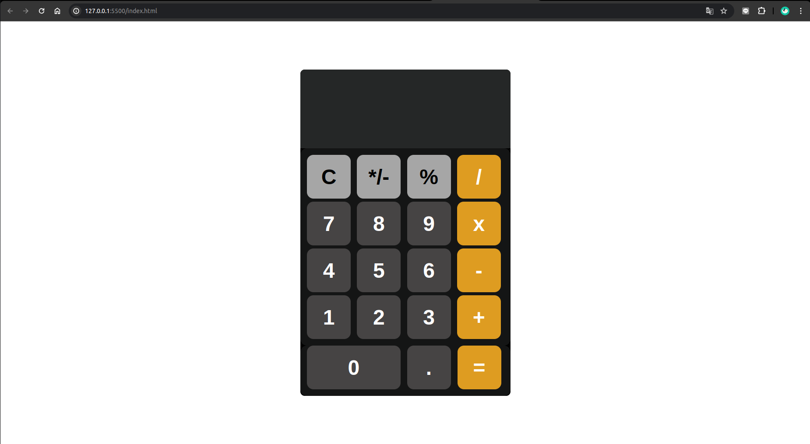

# Clone เครื่องคิดเลขต้นแบบจาก iPhone

## การออกแบบอินเทอร์เฟซผู้ใช้
- **เลย์เอาต์:** จำลองเลย์เอาต์ของเครื่องคิดเลข iPhone รวมถึงการจัดเรียงปุ่มและหน้าจอแสดงผล
- **การออกแบบสไตล์:** ใช้ CSS เพื่อให้ตรงกับรูปลักษณ์และความรู้สึก รวมถึงสี รูปทรงปุ่ม และการจัดตัวอักษร

## การใช้งานฟังก์ชัน
- **หน้าจอแสดงผล:** สร้างหน้าจอเพื่อแสดงตัวเลขที่ป้อนและผลลัพธ์
- **ฟังก์ชันของปุ่ม:** ให้แน่ใจว่าปุ่มแต่ละปุ่ม (ตัวเลข การดำเนินการ และฟังก์ชันพิเศษ เช่น ล้างและเท่ากับ) ตอบสนองต่อการป้อนข้อมูลของผู้ใช้อย่างถูกต้อง
- **ฟังก์ชันคณิตศาสตร์:** สร้างฟังก์ชันคณิตศาสตร์พื้นฐาน: บวก ลบ คูณ และหาร
- **ฟังก์ชันพิเศษ:** รวมฟังก์ชันพิเศษ เช่น ล้าง (C), พลัส/ลบ (±), เปอร์เซ็นต์ (%) และจุดทศนิยม (.)

## การจัดการเหตุการณ์
- **การป้อนข้อมูลของผู้ใช้:** จับการป้อนข้อมูลจากการคลิกปุ่มและอัปเดตหน้าจอให้ตรงตามนั้น
- **ตรรกะการคำนวณ:** ประมวลผลการป้อนข้อมูลเพื่อทำการคำนวณและจัดการกรณีพิเศษ (เช่น การหารด้วยศูนย์)
